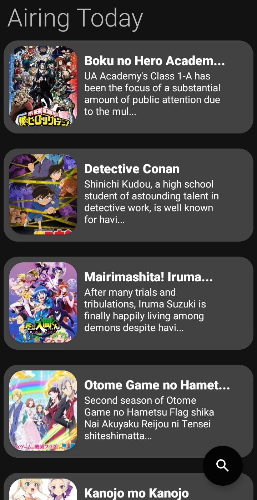

# noire

uhh hello. idk how to do readmes tbh.
I made this app to kill time but I guess it works pretty well and thought someone else could use it too.

[Download noire for Android](https://noireapi.m0stardb0nk.repl.co/api/NoRedirect/new_apk)

## Home 
Continue where you last left off! (Psst! Doesn't need you to log in with MyAnimeList)

## Trending
Find out what's trending.

## Airing Anime
Find out what's airing today.

## Search
Search for something

## Watch
Watch

**Note this doesn't work anymore and I have no plans to fix this**

## Customize
Maybe you'd like a different background?

>Will no longer be updated. 
